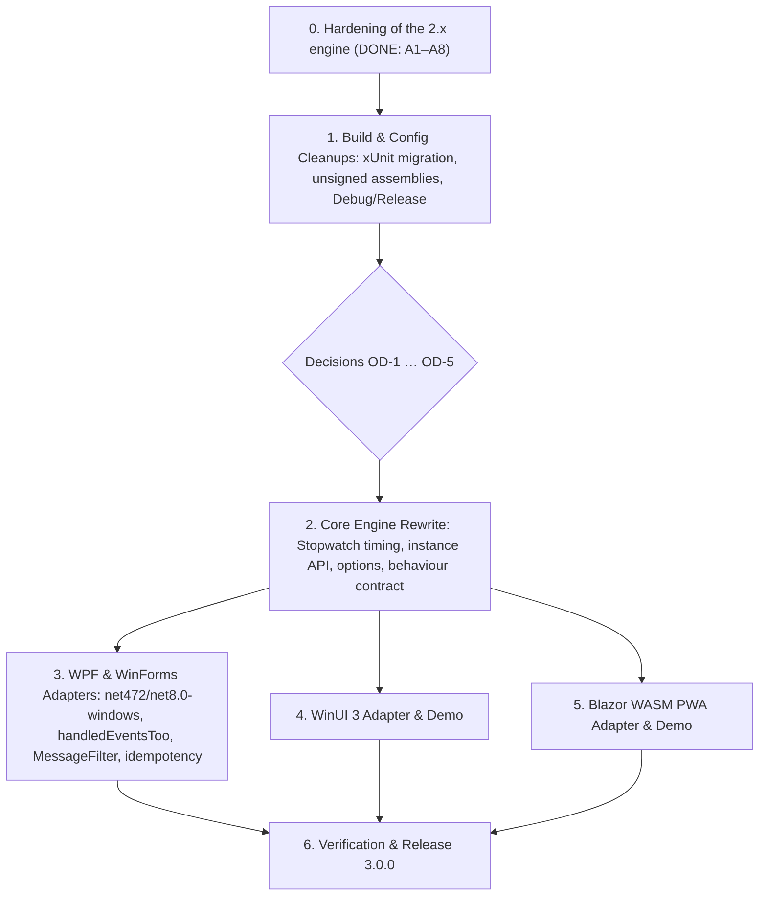

# Implementation Plan: Barcode Scan Detector v3.0 (Multi-Platform)

> **Revision 4 (2026-10-06).** Merges the hardening plan (revision 2) and the multi-platform plan (revision 3) into one. **Where they conflict, the multi-platform plan wins.** The hardening plan's completed work (Phase 0) is kept as a behaviour contract the v3 engine must preserve; its open phases B–D are folded into the phases below or marked superseded. Both source plans remain in git history (`b0d282c`…`370b961` and `aa842b0`).
>
> Facts marked *(verified)* were reproduced with a build, test or probe program, not just read from the code.

## Decisions Already Made

From the multi-platform plan (authoritative):

- **TFM floors:** .NET Framework `4.7.2+` and .NET `8.0+`. Older TFMs are explicitly excluded.
- **Core assets:** `netstandard2.0` (consumed by .NET Framework 4.7.2+) and `netstandard2.1` (consumed by .NET 8.0+).
- **Test framework:** 100% **xUnit** across all test projects.
- **Signing:** `SignAssembly=false` in all projects (strong-naming removed).
- **Build configurations:** standard `Debug` and `Release` (the custom `Optimized` configuration is removed).
- **Blazor scope:** **Blazor WebAssembly PWA**.
- **Timing:** the core engine uses monotonic `Stopwatch.GetTimestamp()`; Blazor uses the high-resolution JS `event.timeStamp`, batched to C#.
- **Release:** the target is **v3.0.0** (breaking).

From the hardening work (already implemented, see Phase 0):

- Only a **completed** scan raises `BarcodeScanned` and starts the scan-completed cooldown.
- The detector is **thread-safe**: one lock per detector; events are raised **after** the lock is released.

## Open Decisions

| ID | Decision | Blocks | Recommendation |
|---|---|---|---|
| **OD-1** | **Name of the instance class.** `BarcodeScanDetector` inside namespace `InspiredCodes.BarcodeScanDetector` fails to compile with **CS0118** ("is a namespace but is used like a type") in the adapters (`InspiredCodes.WPF.BarcodeScanDetector`, `InspiredCodes.WinForms.…`, …) and in any consumer code under an `InspiredCodes.*` namespace *(verified with a scratch build)*. It compiles in `InspiredCodes.BarcodeScanDetector.Tests` and in unrelated namespaces. | Phase 2 | Rename the class (e.g. `KeystrokeScanDetector`, `ScanDetectorEngine`). The alternative, keeping the name and aliasing it in every adapter, pushes the same problem onto consumers. |
| **OD-2** | **Tab terminator semantics** (`ScanTerminators.Enter` / `Tab`). Undefined: is it a flags enum (Enter *and* Tab)? Does a Tab after CR/LF complete a pair the way R2 does for CR/LF? Does a lone Tab with nothing buffered behave like a lone newline (R4)? | Phase 2 | Flags enum, default `Enter`; Tab follows R4; only CR/LF form pairs (R2). |
| **OD-3** | **Time bases.** `ProcessInput(text)` uses `Stopwatch`; `ProcessInput(text, timestamp)` and `ProcessBatch` use the caller's clock (JS `event.timeStamp` is milliseconds since page load). | Phase 2 | One detector instance must never mix time bases (document it; optionally throw when it detects a mix). All cooldown arithmetic uses the input's timestamp; no second clock read (the current engine reads the clock again to start cooldowns). A timestamp earlier than the previous one is treated as delta 0. |
| **OD-4** | **`ScanDetectorOptions` lifetime.** It is a mutable class passed to the constructor. Does the detector see later changes? | Phase 2 | Snapshot (copy and validate) at construction; a running detector never sees half-applied changes, which matches the A6 thread-safety guarantees. |
| **OD-5** | **`BarcodeScannedEventArgs` timestamp.** Today `TimestampTicks` is wall-clock `DateTime.Now`. v3 has detector-timeline `TimeSpan` timestamps. | Phase 2 | Expose the completion timestamp as `TimeSpan` in the detector's time base; drop `TimestampTicks`. |
| **OD-6** | **xUnit version.** The existing WPF/WinForms tests use xunit 2.7.0. xUnit 2 has no runtime skip (`Assert.Inconclusive` is used by `CooldownNewlineTests`); xUnit v3 has `Assert.Skip`. | Phase 1 | **Resolved:** xUnit 2 (2.7.0) in all three projects; the timing guards that would need a runtime skip are `Assert.Fail` until Phase 2 removes them with explicit timestamps. |
| **OD-7** | **Package readme.** The core csproj packs the **root** `README.md`, not `InspiredCodes.BarcodeScanDetector/README.md`. | Phase 6 | Give each package its own short readme, packed from its project folder. |
| **OD-8** | **Authors metadata.** The multi-platform plan sets `Peter Metz (pmetz@inspired.codes)` everywhere; the core and WPF csproj currently say `Peter Metz (pmetz@inspired.codes), Steven Lee`, and the README credits Steven Lee as contributor. | Phase 6 | Confirm whether Steven Lee stays in `Authors`. |
| **OD-9** | **Separate 2.0.2 release** of the Phase 0 fixes before 3.0.0. | — | Not needed under the multi-platform priority: Phase 0 ships as part of 3.0.0. Decide only if 2.x users need the fixes earlier. |

---

## Target Architecture

### Target Framework Matrix

| Project | Target Frameworks | Scope | Currently |
|---|---|---|---|
| `InspiredCodes.BarcodeScanDetector` | `netstandard2.0; netstandard2.1` | Core state machine | same |
| `InspiredCodes.WPF.BarcodeScanDetector` | `net472; net8.0-windows` | WPF extension | `net48; net6.0/8.0/10.0-windows` |
| `InspiredCodes.WinForms.BarcodeScanDetector` | `net472; net8.0-windows` | WinForms extension | `net48; net6.0/8.0/10.0-windows` |
| `InspiredCodes.WinUI.BarcodeScanDetector` | `net8.0-windows10.0.19041.0` | WinUI 3 extension | new |
| `InspiredCodes.Blazor.BarcodeScanDetector` | `net8.0` | Blazor WASM PWA extension (RCL) | new |
| `InspiredCodes.BarcodeScanDetector.Tests` | `net48; net10.0` | Core tests (xUnit) | `net6.0`, MSTest |
| `InspiredCodes.WPF.BarcodeScanDetector.Tests` | `net48; net10.0-windows` | WPF tests (xUnit) | `net48; net6.0/8.0/10.0-windows` |
| `InspiredCodes.WinForms.BarcodeScanDetector.Tests` | `net48; net10.0-windows` | WinForms tests (xUnit) | `net48; net6.0/8.0/10.0-windows` |

Notes:
- Later runtimes consume the nearest floor asset: for the adapters `net472` (Framework) and `net8.0-windows`; for the core `netstandard2.0` / `netstandard2.1`.
- On Linux/macOS the core tests run with `dotnet test -f net10.0` (this also retires the current `DOTNET_ROLL_FORWARD=Major` workaround). On Windows they run under `net48` and `net10.0`.
- Windows-only projects compile on Linux with `-p:EnableWindowsTargeting=true` *(verified for the current WPF/WinForms projects, tests and demos, all four current Windows TFMs)*, but their tests cannot run there. Re-verify for `net472` and for WinUI (unverified; WinUI may need Windows tooling).

### Public API (`InspiredCodes.BarcodeScanDetector`)

> **OD-1 must be resolved first:** the class name `BarcodeScanDetector` below does not compile where it is needed.

```csharp
public sealed class ScanDetectorOptions
{
    public TimeSpan InterKeyThreshold { get; set; } = TimeSpan.FromMilliseconds(32);
    public TimeSpan Cooldown          { get; set; } = TimeSpan.FromMilliseconds(300);
    public int      MaxLength         { get; set; } = 4096;
    public ScanTerminators Terminators { get; set; } = ScanTerminators.Enter; // Enter (\r, \n, \r\n) or Tab — see OD-2
}

public readonly struct KeyInput
{
    public KeyInput(string text, TimeSpan timestamp) { Text = text; Timestamp = timestamp; }
    public string Text { get; }
    public TimeSpan Timestamp { get; }
}

public sealed class BarcodeScanDetector   // name: OD-1
{
    public BarcodeScanDetector(ScanDetectorOptions? options = null);
    public event EventHandler<BarcodeScannedEventArgs>? BarcodeScanned;

    public void ProcessInput(string text);
    public void ProcessInput(string text, TimeSpan timestamp);
    public void ProcessBatch(IList<KeyInput> inputs);
    public void Simulate(string barcode);
    public void Reset();
}

// Static convenience facade for single-window apps
public static class ScanDetector
{
    public static BarcodeScanDetector Default { get; }
    public static BarcodeScanDetector Preview { get; }

    public static event EventHandler<BarcodeScannedEventArgs> BarcodeScanned;
    public static event EventHandler<BarcodeScannedEventArgs> PreviewBarcodeScanned;

    public static void ProcessInput(string text);
    public static void ProcessPreviewInput(string text);
    public static void SimulateBubbleFastInput(string barcode);
    public static void SimulateTunnelFastInput(string barcode);
    public static void Reset();
}
```

### Behaviour Contract

The v3 engine is a rewrite. These rules are implemented and tested in the current engine (Phase 0) and **must hold for the new one**; each has tests to port.

| Rule | Behaviour | From | Tests today |
|---|---|---|---|
| R1 | `\r`, `\n`, `\r\n`, `\n\r` are recognised as Enter; validation does not allocate per character. | A1 | `DetectorConfigTests` |
| R2 | During the cooldown, the **immediate** complement of the newline that ended a scan (`\n` after `\r`, `\r` after `\n`), arriving within the threshold, is discarded **without** extending the cooldown. Only the very next input qualifies. | A2 | `CooldownNewlineTests` |
| R3 | The cooldown starts **before** `BarcodeScanned` is raised and is measured from scan completion, not from when the handler returns. Input fed from a handler runs into it. | A2 | `CooldownNewlineTests` |
| R4 | A terminator with **nothing buffered** raises no event and starts no cooldown (e.g. Enter right after `Reset()` or construction). | A3 | `BufferBoundaryTests` |
| R5 | A scan of exactly `MaxLength` chars is reported; one char more is discarded, raises **no** event (never an empty one) and starts the cooldown. | A3, A5 | `BufferBoundaryTests`, `DetectorConfigLimitsTests` |
| R6 | During the cooldown, input is discarded; fast input extends the cooldown by the full `Cooldown`; slow input does not. `Cooldown = 0` disables it. | A5 | `DetectorConfigLimitsTests` |
| R7 | Options validation: threshold and cooldown must not be negative (0 allowed); `MaxLength` ≥ 1; invalid values throw `ArgumentOutOfRangeException`. | A5 | `DetectorConfigLimitsTests` |
| R8 | Thread-safe: one lock covers every state transition (`ProcessInput`, `ProcessBatch`, `Reset`); `BarcodeScanned` is raised **after** the lock is released, so handlers may block or call back in. `ProcessBatch` collects completed scans under the lock and raises them afterwards, in order. | A6 | `ConcurrencyTests` |
| R9 | Registering an adapter twice forwards each input once; one unregister detaches completely. | A7 | WPF/WinForms test projects (never run, see Phase 0) |
| R10 | The event `sender` is the detector instance (replaces A8, whose `Simulate…(sender, …)` overloads are dropped by the v3 facade; record this in the migration notes). | A8 → v3 | `SenderTests` (rewrite) |

---

## Execution Order



Priority order: **1 → 2 → 3 → 6** is the critical path that replaces today's packages; **4 and 5** add platforms and can follow 3 or run in parallel with it.

---

## Phase 0: Hardening of the 2.x Engine — DONE

All on branch `ehc-01`, committed. Details are in the commit messages.

| Item | Change | Commit |
|---|---|---|
| A1 | `NewLineRN` is `"\r\n"` (was `"\n\r"`), `"\n\r"` still recognised; allocation-free CR/LF check | `6f8228b` |
| A2 | CRLF-pair complement doesn't extend the cooldown; cooldown starts before the event (R2, R3); BPMN annotation updated | `a031a47` |
| A3 | No empty `BarcodeScanned` (4097-char overflow, lone newline) and no cooldown for it (R4, R5); BPMN updated | `93e5ea7` |
| A4 | `TextInputEventArgs`/`ReturnInputArgs` take timestamp **and** delta explicitly | `703a644` |
| A5 | Static `CooldownMillisec`, `MaxBufferLength`, settable `ThresholdMillisec`, with validation (R6, R7); BPMN updated | `0855aec` |
| A6 | One lock per detector, event raised outside it; `Interlocked`/`volatile` config (R8). Before the fix, a 4-thread stress test corrupted 954–1,453 of 1,500 rounds *(verified)* | `32de4c7` |
| A7 | Idempotent `Register…` (detach before attach) in both adapters, docs on `KeyPreview`/observe-only (R9) | `1111069` |
| A8 | `Simulate…(sender, …)` passes `sender` to handlers | `370b961` |

Lessons that carry forward:
- The detectors behind `ScanDetector` are **static**: a test that subscribes to `BarcodeScanned` and doesn't unsubscribe changes every later test (this broke three unrelated tests once). Always unsubscribe in `Dispose`/`finally`.
- Wall-clock tests need ~50 ms margins and stopwatch-relative timing; mutation-check them, because a weak margin can let a broken implementation pass (happened once in A2).
- **Outstanding:** the A7 tests (WPF/WinForms) have never been executed. Run them on Windows once before Phase 3 to have a baseline.

---

## Phase 1: Build & Config Cleanups (on the current engine)

Goal: the toolchain decisions are in place and the **current** engine's 78 core tests pass under xUnit, so they can guard the Phase 2 rewrite.

### 1.1 Migrate the core tests from MSTest to xUnit — DONE (Windows `net48` run pending)
* **Result:** all 78 tests migrated; per test class the count is identical to the MSTest baseline, all pass on `net10.0` (twice, run natively; `DOTNET_ROLL_FORWARD` is no longer needed). The `net48` target compiles on Linux but can only run on Windows: **run `dotnet test InspiredCodes.BarcodeScanDetector.Tests` there once.**
* **Versions:** `xunit` 2.7.0, `xunit.runner.visualstudio` 2.5.7, `Microsoft.NET.Test.Sdk` 17.9.0, `coverlet.collector` 6.0.2, the same as the WPF and WinForms test projects, so all three are aligned (OD-6 resolved: xUnit 2). Moving all three to the latest 2.x is a separate, optional step (those versions weren't in the offline package cache).
* **Mutation spot checks under xUnit:** removing the A6 lock fails the stress test; removing the A3 empty-text guard fails 5 tests; **leaving xUnit's parallelization on fails 20 tests**, so the `AssemblyInfo.cs` switch is required.
* `Assert.Inconclusive` became `Assert.Fail` (same message), and assertions that carried a message use `Assert.True(condition, message)`, because xUnit's `Assert.Equal`/`Assert.Null` take none. `ScanDetectorTests` now subscribes in the constructor and unsubscribes in `Dispose` (it used to leak its handlers).
* **Project:** `InspiredCodes.BarcodeScanDetector.Tests` → `net48; net10.0`, `xunit` + `xunit.runner.visualstudio` (same 2.x version in all three test projects, OD-6); remove `MSTest.TestAdapter`/`MSTest.TestFramework`.
* **Mapping:** `[TestClass]` → plain class; `[TestInitialize]`/`[TestCleanup]` → constructor / `IDisposable`; `[TestMethod]` → `[Fact]`; `[DataTestMethod]`+`[DataRow]` → `[Theory]`+`[InlineData]`; `Assert.ThrowsException` → `Assert.Throws`; `CollectionAssert.AreEqual` → `Assert.Equal`; `Assert.AreSame` → `Assert.Same`.
* **Disable test parallelization** (`[assembly: CollectionBehavior(DisableTestParallelization = true)]`): xUnit runs test classes in parallel by default, and every class drives the same static detector and static config.
* `CooldownNewlineTests` uses `Assert.Inconclusive` as a timing guard; xUnit 2 has no equivalent. Until Phase 2 removes the wall-clock tests, turn the guard into a failure with the same message.
* While migrating, unsubscribe the handlers `ScanDetectorTests` leaves attached.
* **Done when:** the same 78 tests pass on `net10.0` (Linux) and on `net48` + `net10.0` (Windows), and a spot mutation (e.g. removing the A6 lock, removing the A3 empty-text guard) still fails them.

### 1.2 Remove assembly signing — DONE
* Removed `<SignAssembly>True</SignAssembly>` from the core and WPF csproj (no other project had it). It had no effect: there was no key file in the repository and the built assemblies were **not** strong-named *(verified before and after)*, so the output is unchanged. This also removes the earlier `InternalsVisibleTo` concern.

### 1.3 Standard `Debug`/`Release` configurations — DONE
* Removed `<Configurations>Debug;Optimized</Configurations>` and the custom `Debug`/`Optimized` property groups from the core and core-test csproj, and the `<BuildType Project="Debug" />` pin from the solution (it forced the core tests to `Debug` in every solution configuration). Both configurations now use the SDK defaults, so `Release` gets `Optimize=true`.
* Effective changes *(verified with `-getProperty`)*: `Release` is unchanged (it already got the SDK defaults); `Debug` now produces a `portable` PDB instead of `full`; the `Optimized` configuration is gone, and with it the `CheckForOverflowUnderflow` the core tests had only there.
* Verified: the whole solution (Windows projects via `-p:EnableWindowsTargeting=true`) builds in `Debug` and `Release` with 0 errors and the same 10 pre-existing CS8618 warnings; the core tests pass (78/78) in both; a `Release` solution build now builds the core tests as `Release`.

### 1.4 Core csproj fixes — DONE
* Fixed `<FileVersion>$(AssemlbyVersion)</FileVersion>` → `$(AssemblyVersion)`. Cosmetic, as expected: the evaluated `FileVersion` is now `2.0.1.0` instead of empty, and the generated `AssemblyFileVersion` attribute stays `2.0.1.0` *(verified)*.
* Rewrote the stale `PackageReleaseNotes` ("removed netstandard, … dependency to WPF") to describe the package as it is: no UI dependencies, `netstandard2.0`/`netstandard2.1`, WPF and WinForms integration in separate adapter projects. It deliberately lists no changes, because the version is still 2.0.1; the change list belongs in the 3.0.0 notes (6.2/6.3). Verified in the built `.nupkg`'s nuspec.

**Phase 1 is complete** apart from running the core tests' `net48` target on Windows (see 1.1).

---

## Phase 2: Core Engine Rewrite

**Gate:** OD-1 to OD-5 decided.

### 2.1 Namespace and public types
* All core types move from `InspiredCodes.WPF.BarcodeScanDetector` to `InspiredCodes.BarcodeScanDetector`. Type forwarders cannot alias a namespace, so this is a documented break (migration notes in 6.3).
* Public API as in *Public API* above. `ScanDetector` becomes a `static class`.
* Public surface review: `DetectorData`, `TextInputEventArgs`, `ReturnInputArgs` become `internal` or disappear; the static `DetectorConfig` is replaced by `ScanDetectorOptions` (OD-4).

### 2.2 Timing
* Monotonic `Stopwatch.GetTimestamp()`, converted with `Stopwatch.Frequency` (its ticks are not 100 ns). `Environment.TickCount64` does **not** exist on `netstandard2.0`/`2.1` *(verified, CS0117)*.
* `ProcessInput(text, timestamp)` and `ProcessBatch` use the caller's timestamps; every cooldown start and comparison uses the timestamp of the input being processed (OD-3).
* `Simulate(barcode)` generates synthetic timestamps instead of sleeping. Today's `SimulateFastInput` blocks the calling thread with `Task.Delay(...).Wait()`, which freezes a UI thread.

### 2.3 Options and terminators
* `ScanDetectorOptions` as in *Public API* above, with the R7 validation; snapshot at construction (OD-4).
* `ScanTerminators` per OD-2.

### 2.4 Tests (port the behaviour contract)
* Port every test listed in the *Behaviour Contract* to the new API. Use **explicit timestamps** instead of `Thread.Sleep`, so cooldown boundaries are asserted exactly and the 50 ms wall-clock margins and runtime-skip guards disappear.
* Keep the concurrency stress test (R8) unchanged in spirit: N threads, one buffered scan, simultaneous terminators, exactly one event.
* Add: interleaved typing (fast burst, pause > threshold, fast burst → no event); `ProcessBatch` with several scans in one batch (events in order, raised outside the lock); Tab terminator (OD-2); time-base rules (OD-3).

### 2.5 BPMN
* Update `Documentation/CharInputStateMachine.bpmn` for v3: option names, terminators, the empty-scan path (R4). The annotation already documents R2, R3, R4 and the configurable defaults.

---

## Phase 3: WPF & WinForms Adapters

### 3.1 Target frameworks
* Adapters `net472; net8.0-windows`; their tests `net48; net10.0-windows` (from today's `net48; net6.0/8.0/10.0-windows`).

### 3.2 WPF (`InspiredCodes.WPF.BarcodeScanDetector`)
* Register with `AddHandler(TextCompositionManager.TextInputEvent, handler, handledEventsToo: true)` (and the preview event likewise) to catch input that focused controls mark as handled.
* **Breaking:** `AddHandler(…, handledEventsToo)` exists on `UIElement`, not on `IInputElement`, so the extension target changes from `IInputElement` to `UIElement`. The current `MockInputElement` tests no longer apply; tests need a real `UIElement`, created on an STA thread.
* Extension methods take an optional detector instance (default `ScanDetector.Default` / `.Preview`).
* Idempotency via a `ConditionalWeakTable` of (element, detector) → handler. Today's detach-before-attach trick (A7) only works because the handler is one static method; per-detector handlers are closures, and a new closure never equals the attached one.

### 3.3 WinForms (`InspiredCodes.WinForms.BarcodeScanDetector`)
* Add `BarcodeScanMessageFilter : IMessageFilter` (`WM_CHAR` at application level): it sees typed characters wherever the focus is, without `KeyPreview`.
* `RegisterKeyPress` stays and stays idempotent (R9); with a detector parameter it needs the same `ConditionalWeakTable` approach as WPF. Its doc keeps the `KeyPreview = true` note.
* Package metadata (description, license, authors, icon) and `GeneratePackageOnBuild=true`.

### 3.4 Demos and verification
* Update `WpfDemo` and `WinFormsDemo` to the v3 API.
* Compile-check on Linux (`-p:EnableWindowsTargeting=true`); run the tests and demos on Windows.

---

## Phase 4: WinUI 3 Adapter & Demo

* `InspiredCodes.WinUI.BarcodeScanDetector` (`net8.0-windows10.0.19041.0`): attach to the root `UIElement` / `Window.Content` via `CharacterReceivedEvent` with `handledEventsToo: true`; optional detector parameter; idempotent like 3.2.
* Demo: `InspiredCodes.BarcodeScanDetector.WinUIDemo` (WinUI 3 desktop app).
* Verification: Windows; check early whether it builds on Linux at all.

---

## Phase 5: Blazor WebAssembly PWA Adapter & Demo

* `InspiredCodes.Blazor.BarcodeScanDetector` (`net8.0` RCL): capture-phase JS `keydown` listener recording `event.timeStamp`; batched interop to `ProcessBatch(inputs)` on a terminator or after 100 ms of silence.
* Timestamps are in the page's time base, so each Blazor detector uses only `ProcessBatch` (OD-3). Batching adds latency to the event, not to the measured key intervals.
* Scoped DI service `BlazorBarcodeScanService` and a `<BarcodeScanListener>` Razor component.
* Demo: `InspiredCodes.BarcodeScanDetector.BlazorPwaDemo` (Blazor WASM PWA).

---

## Phase 6: Verification & Release 3.0.0

### 6.1 Verification matrix

| Check | Where | Command / action |
|---|---|---|
| Core build | any OS | `dotnet build InspiredCodes.BarcodeScanDetector/InspiredCodes.BarcodeScanDetector.csproj` |
| Core tests | Linux/macOS: `net10.0`; Windows: `net48` + `net10.0` | `dotnet test InspiredCodes.BarcodeScanDetector.Tests -f net10.0` (Linux) |
| WPF / WinForms / WinUI tests | Windows | `dotnet test` on each test project |
| Windows projects compile | Linux | `dotnet build <project> -p:EnableWindowsTargeting=true` |
| Blazor | any OS + browser | build; run the PWA demo; scan with a real scanner and with the simulator |
| Demos | per platform | simulator (UUIDv7) and a real scanner if available |
| Packages | any OS | inspect each `.nupkg`: readme (OD-7), icon, version 3.0.0, metadata (OD-8) |

### 6.2 Versioning and packaging
* Bump `AssemblyVersion`/`FileVersion`/`Version` to 3.0.0 in **every** csproj (they are duplicated by hand).
* Consistent package metadata per the decisions above (OD-8).

### 6.3 Documentation
* Migration notes 2.x → 3.0: namespace move; `DetectorConfig` → `ScanDetectorOptions`; `ScanDetector` facade changes (instances, dropped `Simulate…(sender, …)` overloads); WPF extension target `IInputElement` → `UIElement`; dropped TFMs (`net6.0`, below `net472`); no strong name; no `Optimized` configuration.
* Root `README.md`: replace the absolute `file:///c:/Users/Peter/...` links with repository-relative ones; document all four platforms.
* `InspiredCodes.BarcodeScanDetector/README.md`: remove the nonexistent `ScanDetector.Register(this)`, the wrong type name `BarcodeScannedArgs`, the stale "needs PresentationCore" claim, and the internal Steelcase feed/push/delete commands and `@since … @steelcase.com` line.
* State everywhere that the detector **observes** input and never suppresses it.
* `CLAUDE.md`: commands (`-f net10.0`, `Debug`/`Release`), architecture (instances, adapters, Blazor/WinUI).

### 6.4 Publish
* NuGet 3.0.0 for core, WPF, WinForms, WinUI and Blazor packages.

---

## Superseded Items from the Hardening Plan

For traceability; nothing below needs doing as written.

| Old item | Superseded by |
|---|---|
| B1 injectable `Func<long>` clock, `InternalsVisibleTo` | Phase 2.2 timestamp API (the explicit-timestamp overloads are the test seam); Phase 1.2 (no signing) |
| B2 core tests on `net8.0;net10.0`, MSTest updates | Phase 1.1 (xUnit, `net48; net10.0`) |
| B3 test expansion | 2.4 |
| C1 namespace move | 2.1 |
| C2 instance detectors, options, adapter overloads | *Public API*; Phases 2.1, 3.2, 3.3 |
| C3 public surface review | 2.1 |
| D1 csproj typo, release notes | Phase 1.4 |
| D2 package readme | OD-7, 6.3 |
| D3 documentation cleanup | 6.3 |
| D4 BPMN | done for Phase 0; v3 update in 2.5 |
| D5 WinForms package metadata | 3.3 |
