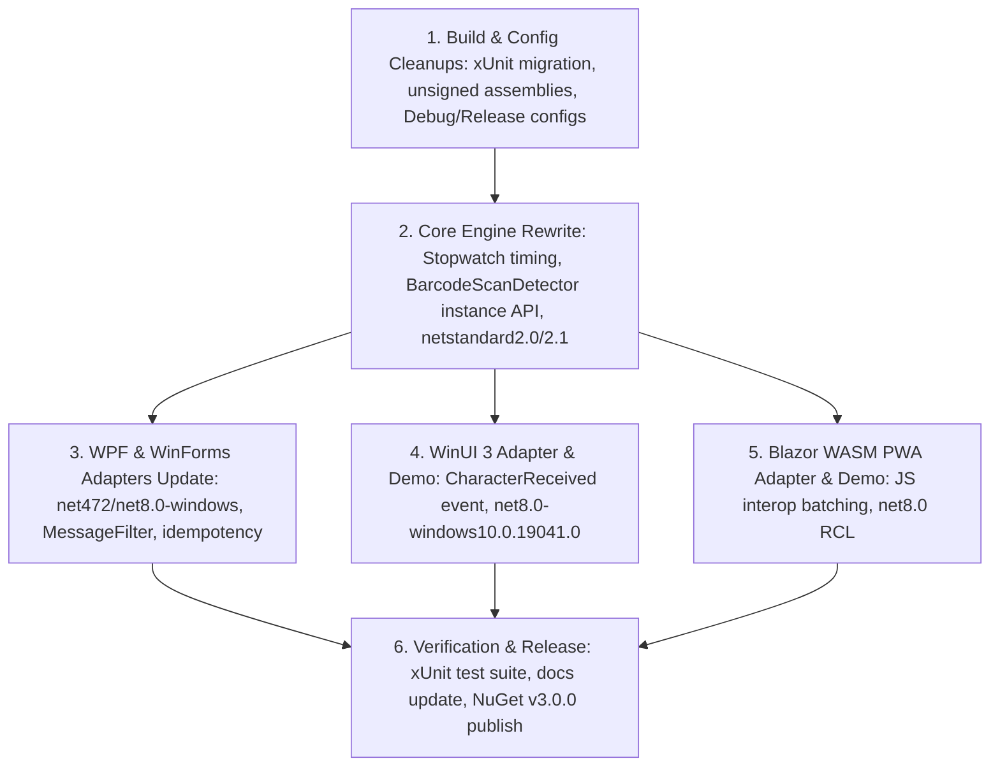

# Implementation Plan: Multi-Platform Barcode Scan Detector (v3.0)

> **Revision 3 (2026-10-06).** Finalized with user decisions:
> - **TFM Floors:** .NET Framework `4.7.2+` and .NET `8.0+`. Older TFMs are explicitly excluded.
> - **Core Assets:** `netstandard2.0` (for .NET Framework 4.7.2+) and `netstandard2.1` (for .NET 8.0+).
> - **Test Framework:** Consolidated 100% on **xUnit** across all test projects.
> - **Signing:** `SignAssembly=false` across all projects (strong-naming removed).
> - **Build Configurations:** Standard `Debug` and `Release` (custom `Optimized` configuration removed).
> - **Blazor Scope:** **Blazor WebAssembly PWA** target.

---

## 1. Solution Architecture & Target Framework Strategy

### 1.1 Target Framework Matrix

| Project | Target Frameworks (TFMs) | Target Scope |
|---|---|---|
| `InspiredCodes.BarcodeScanDetector` | `netstandard2.0; netstandard2.1` | Core hardware-agnostic state machine |
| `InspiredCodes.WPF.BarcodeScanDetector` | `net472; net8.0-windows` | WPF UI Extension |
| `InspiredCodes.WinForms.BarcodeScanDetector` | `net472; net8.0-windows` | WinForms UI Extension |
| `InspiredCodes.WinUI.BarcodeScanDetector` | `net8.0-windows10.0.19041.0` | WinUI 3 Extension |
| `InspiredCodes.Blazor.BarcodeScanDetector` | `net8.0` | Blazor WASM PWA Extension (RCL) |
| `InspiredCodes.BarcodeScanDetector.Tests` | `net48; net10.0` | Core Unit Tests (xUnit) |
| `InspiredCodes.WPF.BarcodeScanDetector.Tests` | `net48; net10.0-windows` | WPF Extension Tests (xUnit) |
| `InspiredCodes.WinForms.BarcodeScanDetector.Tests` | `net48; net10.0-windows` | WinForms Extension Tests (xUnit) |

> **Notes on TFMs:**
> - Later runtimes (.NET 4.8, 4.8.1, .NET 9, .NET 10) consume the nearest floor asset (`net472` for Framework, `net8.0` for Core).
> - On Linux/macOS, tests run under `net10.0` (`dotnet test -f net10.0`). On Windows, tests run under `net48` and `net10.0`.

---

## 2. Decision Record & Configuration Standards

1. **Assembly Signing:**
   - Remove `<SignAssembly>True</SignAssembly>` from all `.csproj` files. Assemblies are unsigned.
2. **Build Configurations:**
   - Remove custom `<Configurations>Debug;Optimized</Configurations>` from `.csproj` files.
   - Standardize on standard .NET `Debug` and `Release` configurations (`<Optimize>true</Optimize>` under `Release`).
3. **Test Framework Consolidation (xUnit):**
   - Migrate `InspiredCodes.BarcodeScanDetector.Tests` from MSTest to **xUnit** (`xunit`, `xunit.runner.visualstudio`).
   - Remove MSTest dependencies (`MSTest.TestAdapter`, `MSTest.TestFramework`).
   - All test projects in the solution now use xUnit.
4. **NuGet Packaging & Metadata:**
   - Ensure author and owner metadata is consistently set to `Peter Metz (pmetz@inspired.codes)` across all packable projects.
   - Enable `GeneratePackageOnBuild=true` on `InspiredCodes.WinForms.BarcodeScanDetector.csproj` with complete metadata (Description, License, Authors, Icon).
   - Fix typo `<FileVersion>$(AssemblyVersion)</FileVersion>` in core project.
5. **Desktop & Browser Timing:**
   - Core engine uses monotonic `Stopwatch.GetTimestamp()` for interval and delta calculations (eliminates `DateTime.Now` clock drift and 15.6ms resolution coarseness on .NET Framework).
   - Blazor WASM uses high-resolution `event.timeStamp` captured in JS and batched to C#.

---

## 3. Core Engine Redesign (v3.0)

### 3.1 Public API (`InspiredCodes.BarcodeScanDetector`)

Namespace: `InspiredCodes.BarcodeScanDetector`

```csharp
public sealed class ScanDetectorOptions
{
    public TimeSpan InterKeyThreshold { get; set; } = TimeSpan.FromMilliseconds(32);
    public TimeSpan Cooldown          { get; set; } = TimeSpan.FromMilliseconds(300);
    public int      MaxLength         { get; set; } = 4096;
    public ScanTerminators Terminators { get; set; } = ScanTerminators.Enter; // Enter (\r, \n, \r\n) or Tab
}

public readonly struct KeyInput
{
    public KeyInput(string text, TimeSpan timestamp)
    {
        Text = text;
        Timestamp = timestamp;
    }
    public string Text { get; }
    public TimeSpan Timestamp { get; }
}

public sealed class BarcodeScanDetector
{
    public BarcodeScanDetector(ScanDetectorOptions? options = null);
    public event EventHandler<BarcodeScannedEventArgs>? BarcodeScanned;

    public void ProcessInput(string text);
    public void ProcessInput(string text, TimeSpan timestamp);
    public void ProcessBatch(IList<KeyInput> inputs);
    public void Simulate(string barcode);
    public void Reset();
}

// Static convenience facade for single-window apps
public static class ScanDetector
{
    public static BarcodeScanDetector Default { get; }
    public static BarcodeScanDetector Preview { get; }

    public static event EventHandler<BarcodeScannedEventArgs> BarcodeScanned;
    public static event EventHandler<BarcodeScannedEventArgs> PreviewBarcodeScanned;

    public static void ProcessInput(string text);
    public static void ProcessPreviewInput(string text);
    public static void SimulateBubbleFastInput(string barcode);
    public static void SimulateTunnelFastInput(string barcode);
    public static void Reset();
}
```

---

## 4. UI Adapters Implementation

### 4.1 WPF (`InspiredCodes.WPF.BarcodeScanDetector`)
- Uses `AddHandler(TextCompositionManager.TextInputEvent, handler, handledEventsToo: true)` for `UIElement` to catch inputs swallowed by focused controls.
- Extension methods accept optional `BarcodeScanDetector` instance (defaults to `ScanDetector.Default`).
- Idempotent registration tracking via `ConditionalWeakTable`.

### 4.2 WinForms (`InspiredCodes.WinForms.BarcodeScanDetector`)
- Adds `BarcodeScanMessageFilter : IMessageFilter` (`WM_CHAR` filtering at application level).
- `RegisterKeyPress` extension method made idempotent.
- Package metadata enabled and aligned.

### 4.3 WinUI 3 (`InspiredCodes.WinUI.BarcodeScanDetector`)
- Attaches to root `UIElement` / `Window.Content` via `CharacterReceivedEvent` (`handledEventsToo: true`).
- Demo project: `InspiredCodes.BarcodeScanDetector.WinUIDemo` (WinUI 3 desktop app).

### 4.4 Blazor WebAssembly PWA (`InspiredCodes.Blazor.BarcodeScanDetector`)
- Capture-phase JS `keydown` listener capturing `event.timeStamp`.
- Batched interop calls to `.ProcessBatch(inputs)` on newline or 100ms silence.
- Scoped DI service `BlazorBarcodeScanService` and `<BarcodeScanListener>` Razor component.
- Demo project: `InspiredCodes.BarcodeScanDetector.BlazorPwaDemo` (Blazor WASM PWA).

---

## 5. Execution Plan & Phases


